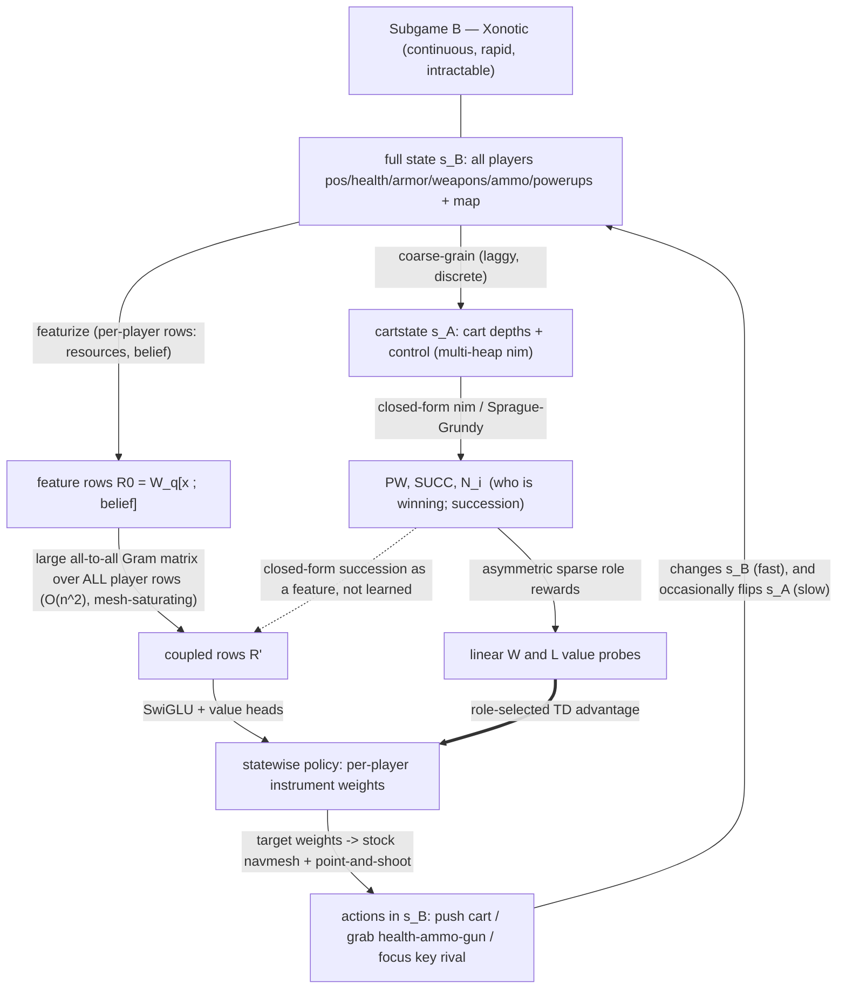

# MULTISCALE.md — two nested subgames, two value estimators, a statewise policy

This document fixes the single most load-bearing idea in the project and the one agents
keep dissolving into an ML default: **the problem is multiscale.** There are two
subgames at two scopes; only one of them is closed-form-interpretable; and its sparse
role rewards train two value estimators over the other. The learned operator is
feed-forward and acts statewise; training observes real transitions without putting
recurrence into the policy.

## 1. The two subgames (two scopes)

**Subgame B — Xonotic point-and-shoot (the real game).** Basically-continuous, rapidly
updating. Its state is the full resource configuration: every playerbot's position,
velocity, health, armor, weapons owned, ammo, powerup timers — plus the map. This is
where all action happens (move, shoot, grab health/ammo/guns, knock enemies around).
**It is intractable.** There is no closed-form scheme that tells you what a Xonotic
state *means* in the semantics of winning or losing. You cannot analytically price it.

**Subgame A — the cartgame (the tractable shadow).** Discrete, and *laggy* — its state
(cart depths + control) changes slowly and in steps, a coarse projection of B. Each cart
on its path is a heap; the board is a multi-heap nim-like counting game. **It is
closed-form-interpretable:** `PW(s)` (projected winner, nim-sum), `SUCC(s)` (the
backward-induction succession), and the per-team hierarchy `N_i(s)` are exact
combinatorics over cartstate. Subgame A is where "who is winning / losing" has a
*computable meaning*.

**Containment.** B totally contains A — the carts live inside the Xonotic map; the
cartgame state is a coarse-graining of the full Xonotic state. A is B's tractable
shadow: the only place the game exposes closed-form winning/losing semantics.

```
   Subgame B : Xonotic point-and-shoot   (continuous, rapid, INTRACTABLE, no closed-form meaning)
   ┌───────────────────────────────────────────────────────────────────────┐
   │  all players: pos, vel, health, armor, weapons, ammo, powerups, map    │
   │                                                                        │
   │        coarse-grain ▼ (a laggy discrete projection)                    │
   │   Subgame A : cartgame  (discrete, laggy, TRACTABLE, closed-form)      │
   │   ┌───────────────────────────────────────────────┐                    │
   │   │  cart depths + control  =  multi-heap nim      │                    │
   │   │  PW / SUCC / N_i  = who is winning, computable │                    │
   │   └───────────────────────────────────────────────┘                    │
   └───────────────────────────────────────────────────────────────────────┘
```

## 2. Why `reward = score` and whole-game RLVR are both degenerate

We do **not** price states with the score, and we do **not** train on the terminal win
(RLVR). Both are informationally degenerate for *this* game.

- **`reward = score` is degenerate** because scores integrate monotonically toward
  victory. A monotone integrator carries no per-state gradient about your *strategic
  situation*: you can lead on score and be one coordinated push from losing the winning
  region. Pricing by the level of a monotone quantity cannot distinguish "safely ahead"
  from "ahead and about to be ganged."

- **Whole-game RLVR (`reward = win`) is degenerate** because the terminal-win scalar has
  *marginalized away the multipolar structure*. Optimizing `E[win]` gives a gradient
  that cannot tell "teams B and C are coordinating against me" from "I am simply
  losing," because both collapse into the same expectation. A policy trained on it is
  **formally unable to notice it is being ganged up on** — the identity of who is
  ganging whom is a function of *all teams'* cartstates (the hierarchy/succession), and
  the win-scalar does not carry it. RLVR also replaces an available analytic quantity
  with a single terminal scalar that discards the role transition where the useful
  training event occurred.

The multiscale structure is exactly what lets us avoid both: **derive separate sparse
W/L rewards from subgame A and learn their values over subgame B.**

## 3. The two role values

The cart projection supplies the current role and the sparse events that ground two
different value estimators over the full Xonotic state.

1. **Semantics** — from cartstate, closed-form: `PW`, `SUCC`, `N_i`. Who is the
   projected winner and what is the succession if the leader is denied.
   > "Nimber-Preserving Reduction: Game Secrets and Homomorphic Sprague-Grundy Theorem"
   > (Burke, Ferland, Teng, FUN 2022) — the position value is the PSPACE-hard *game
   > secret*; where the reduction is impartial it is an exact nim-sum, and partizan/
   > cyclic positions are kept explicitly unresolved. The cart path is the Generalized
   > Geography carrier of each heap's magnitude.

2. **Estimate** — `W` learns the return of the sparse event in which the current winner
   loses its path. `L` learns the return of sparse upward flips in rank among losers;
   holding or losing rank has zero immediate reward, and acquisition is the final upward
   flip. They are separate linear probes on the final IR, not symmetric duals and not a
   separate hand-built controller. A W return never bootstraps from L, and an L return
   never bootstraps from W; changing role terminates the old role's return.

3. **Act** — the role-selected temporal-difference advantage is the learning signal for
   a policy that acts through the **full B abstraction**: which resources to dominate
   (health/ammo/guns), which rival to
   focus, which cart to push — to *prevent perturbation of the winning state*. The
   policy is a **learned filter on full resource state**: e.g. whether a bot holding a
   rocket launcher should run at the cart (spend the resource lead) or at more health/
   ammo (extend it), *and* which cart.

The locally action-linear dynamics ensemble estimates unknown action effects and can
guide exploration. It does not redefine either value estimator or replace their
rewards.

## 4. Statewise, not sequential — no recurrence

There is **no recurrent policy or recurrent value model.** The hard succession and
backward-induction features are closed-form per state in subgame A. Real transitions,
replay, and temporal-difference returns train feed-forward estimators without an RNN.

- A game history supplies transitions and role rewards; replay does not impose a
  recurrent architecture.
- The policy is a **statewise map** `state → per-player action distribution`, trained to
  act well given the role-selected value and advantage.

This is why the learned operator is **shallow-and-wide (a large Gram-matrix fusion + SwiGLU), not a deep
multi-head-attention-resnet and not an RNN.** Depth/recurrence would only be forced if
we made the network *learn* the `H`-hop succession; we compute it. What remains is a
statewise pricing readout — one big all-to-all matmul over the player rows, the compute
shape that saturates a bandwidth-bound mesh of M-series SoCs, rather than a latency-bound
serial stack.

## 5. Ball-and-stick data flow



Text form of the same graph:

```
 full Xonotic state s_B ──coarse-grain──► cartstate s_A ──nim/SG──► PW,SUCC,N_i
        │                                                              │
        │                                              sparse rewards  ▼
        │                                                   W head / L head
        │                                              selected advantage
        └──featurize──► player rows ──GRAM MATRIX (all-to-all, O(n^2))──► R' ─SwiGLU/value─► statewise policy
                                            ▲ (SUCC as feature)                 │
                                            └── closed-form, not learned        ▼
                                              per-player instrument weights ──stock navmesh + point&shoot──► actions
                                                                                          │
                                              actions change s_B fast, flip s_A slow ◄────┘
```

## 6. What this forbids

- No analytic pricing of subgame B directly — learn W/L values over its state from the
  sparse cart-subgame events.
- No `reward = score`, no whole-game RLVR — both degenerate (§2).
- No recurrent learned state machine — feed-forward values and policy (§4).
- No deep attention/resnet in the learned operator — the depth is closed-form in A; the
  learned part is one large Gram-matrix fusion + SwiGLU (§4, and the expressivity note in the strategy
  spec).
- No fake re-simulation of the game to train against — B is already the simulation;
  train on it or prove the price. Synthetic re-simulation is not Game-2 evidence.
