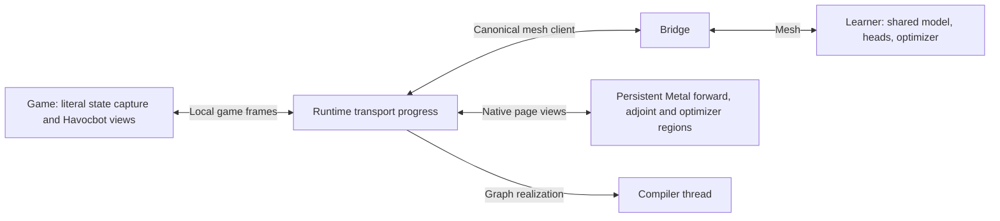

# Policy transport ownership

The numerical runtime owns the server participant's single mesh allocator/context.
The game is a client of that runtime. This is the source implementation as of
September 7, 2026. The native library and policy shaders build locally; this new
transport path has not been deployed or measured on a live mesh.

`mesh_ipc.c` serializes game publications once into retained packet storage. Its
nonblocking socket pump advances finite batches and returns to the engine. A full
or temporarily absent worker socket leaves unsent packets queued. The engine
recycles a packet only after all its datagrams were accepted locally. Local
acceptance is not an end-to-end acknowledgement or durable storage promise.

`runtime_transport.py` alone touches `Mesh`. Its progress loop interleaves local
receives, mesh receives, network publication, bounded response framing and local
replies. Numerical requests never pass through the game. Other mesh packets are
retained until a local game client registers, then delivered to registered clients;
native response handles perform the existing kind/source/session matching.
A departed local socket is reported with its undeliverable datagram count.

`matrix_worker.py` hosts the compiled tensor worker. One compiler thread realizes
the symbolic graph and persistent Metal commands. The main I/O thread alone
progresses scoped native calls, observes GPU completion and releases page borrows.
Game frames and tensor-control messages share the context's registered application
receiver; native stream progress remains the sole reader of the completion ring.
It cannot consume game frames as stream headers or race a second ring reader.

Control messages carry a program identity, binding incarnation, request identity,
phase and parameter generations. They are assembled and deduplicated independently
of numerical data. Tensor spans use fixed native windows. Metal copies larger
bundles to persistent storage and directly reads complete resident input bundles
through native page views. Borrowed pages outlive every consuming GPU command.
Result staging remains separate from live local inputs and optimizer state until
the complete remote invocation succeeds. See
[the policy execution contract](POLICY-PROGRAM.md#persistent-execution-and-transport).

A replaced worker or mapping requires new bindings and current parameter uploads.
Old bindings retire through GPU completion; they cannot rewrite a newly realized
view table after its capacity has changed. A failed numerical operation is reported
without stopping game I/O. Install requests have the same finite control budget as other requests. Compilation
continues on the worker after the requester falls back locally; retries coalesce
while a prior compile is running. A one-second retry interval lets intervening
regions execute locally. Idle worker/control caches expire after four minutes.
These caches contain no retained training examples or authoritative checkpoints.

The local control envelope uses the existing `<iII` layout: node, frame bytes, count.
Zero frame bytes marks a hello, with `LOCAL_VERSION` as its count. The reply adds
five `<Q` values: canonical slot count, stride, usable bytes, runtime incarnation,
and queued/in-flight frames. The engine sends a hello every second, discovers a
restarted worker at the same socket, and reports both failures and recovery.
Pending publications retain their original frame width. The runtime reassembles
and reframes a complete message when the transport payload width has changed;
source values, request identity and session remain intact. Receiver assembly derives
fragment capacity from the received frame, including after checkpoint recovery.
Framed publication pumps mapping recovery and has a five-second budget; an
incomplete publication reports its identity and offered-frame count. It does not
claim remote delivery merely because a local transmit slot accepted bytes.
An empty source message
keeps its explicit zero-row header.

Native convenience I/O attempts attachment once per invocation. Retry timing
belongs to the owner, outside the numerical calculation. Python refreshes realized
receive storage after a bridge layout change. `mesh_readv` leaves a descriptor
queued when its payload would exceed the caller's buffer, allowing that caller to
grow storage and retry. Native response receipt capacity grows independently from
row capacity. These capacity checks preserve access to the complete payload.

The runtime is started for every curriculum server, even when all policy arithmetic
is local. Its process and log persist with the server across matches. The supervisor
stops it after the game has exited and retains it if game shutdown has not completed.
An ordinary runtime replacement reopens the same local socket. The bridge and its
verbs device do not restart as part of this application lifecycle.

Shutdown drains owned network publication and drives the native detach handshake
within a finite budget. It reports unfinished transport and numerical work. It does
not wait for a GPU thread to finish indefinitely, forcibly kill a bridge, or claim
that process exit cancels an outstanding GPU command.

Application snapshots build both `libmesh.dylib` and `libmesh-tensor.dylib` with
relative library resolution and include the matching Python and wire sources.
The old `TensorPacket`, `WorkerState` and eager scale/cross RPC implementations
are removed. `RemoteScale` and `RemoteCross` now declare graph placement only.
