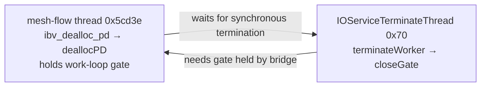

# RDMA teardown and kernel failure, 2026-09-05

The Mini incident contains a confirmed kernel deadlock. The initial DMA fault is
still unexplained. This repository owns the userspace verbs lifecycle;
AppleThunderboltRDMA and IORDMAFamily are supplied by macOS. Their implementation
source and a deployable driver build target are absent from this repository and
the installed SDK. These changes do not patch Apple's kernel.

## September 5, authorized recovery and receive-address repair

The operator gave standing authorization to restart idle mesh machines, now recorded
in [AGENTS.md](../AGENTS.md#idle-node-restart-authorization). At 15:17 PDT the Mini had
zero user sessions, no active application client or learner, and its training service
persistently disabled. After bounded graceful bridge teardown, an ordinary
`shutdown -r now` was issued. SSH answered at the first check 16.93 seconds later;
the boot UUID changed to `06644098-ABAA-4DDF-8940-52972AE76D34`. The bridge restarted
and recovered pairing. The M5 host was not rebooted. This measures observed SSH
recovery from that request; it is not an RDMA service downtime estimate.

Pairing recovered RX queue allocation, but the first eight-byte stream still timed
out. Root receive completions named pages whose contents remained zero, while the
peer's send buffers contained valid headers. A read-only scan of shared memory found
77 valid protocol frames at addresses exactly 4 GiB below the expected receive bank.
Sixteen protocol-sized descriptors in the captured root trace match shifted frames;
other early trace entries include six-byte heartbeats.

Disassembly of the installed M5 `/usr/lib/rdma/libthunderboltrdma.dylib` shows
`tbt_post_recv` loading the low 32 SGE address bits and encoding them with the memory
region key. The previous 1 GiB registrations began relative to an unaligned mapping,
so a registration could cross a 4 GiB virtual-address boundary. Splitting registrations
at aligned 1 GiB address boundaries fixes the observed alias. Send and receive share
the same absolute-address key lookup; the full 32 GiB / 6 GiB capacities remain.
The region arithmetic is specified in [the stream ABI](abi-streams.md#registered-address-boundaries).

Prefaulting the mapping did not restore correct receives. Explicit zero IOVA
registration was rejected with errno -102 on both hosts. Neither trial remains in the
deployed source. Diagnostic tracing binaries were replaced by normal bridge builds.

With aligned registration and the preceding stream/credit fixes, 735 byte rounds and
two complete 160-case projection sweeps passed: 7,680 projection rounds, matching rank
hashes, maximum normalized RMSE 1.40824e-6, and zero bridge errors. The final snapshots
show both bridges paired, responsive and unowned, with drained application rings.
Bridge PIDs are 65814 / 27190; training remains disabled. Each projection sweep spans
about 14 seconds between its first and last reports. This establishes recovery and
short-cohort correctness, not long-term availability or a kernel defect-rate estimate.
The 16 MiB stress extension was not rerun. The address repair does not establish the
cause of the earlier kernel panics or driver RX resource exhaustion.

Evidence remains in metal-microbench's measurement JSON and artifact directory,
including `reboot-authorized.json`, `receive-location-scan.json`, both wire traces,
`provider-current-disassembly.txt`, the three `*-aligned-*` cohorts, and sanitizer logs.

## September 5, afternoon tensor-parallel measurement

The operator suspended the game training service and freed both application slots.
The matrix benchmark used the shared-memory stream client, without opening another
verbs context. The first probe crashed in userspace at `mesh_turn+992` when DATA
replay accessed a receive bitmap already freed by FIN completion. The client now
ignores DATA outside running receive states and does not revive completed senders
on late REQ.

At approximately 14:27 PDT, during a later 16 MiB phase, the Mini panicked with
`IOThunderboltFamily + 0x343c`, fault address `0x98`, and AppleThunderboltRDMA in
the backtrace. This is the earlier null-derived data-abort signature, not proof
of a new failure mechanism. The Mini rebooted automatically and paired again.
No host reboot command or uncatchable signal was issued. The saved filename
`peer-watchdog.panic` is historical; its contents describe a data abort and should
not be conflated with the earlier shutdown watchdog deadlock. Transfer size is
not established as the kernel trigger.

Two short projection cohorts and the smaller byte cohorts subsequently completed.
Removing bridge sleep during application ownership reduced an eight-byte roundtrip
from roughly 778 to 13 microseconds in sequential ten-sample cohorts. A longer
cut sweep then timed out at stream generation 1029632 after 38 completed records.
The root bridge recorded 949,579 aggregate errors; the peer submitted 1,225,401
frames and recorded 10 errors. Counters are consistent with CMP overflow, but
`bad` does not encode individual causes. The peer logged completion status 4,
`IOConnectUnmapMemory` failures and then repeated RTR rc 16 (`EBUSY`). These
observations do not establish the causal link to the closed-source driver fault.

The client retried FIN on local NIC completion, which could amplify control
traffic while the remote application had not advanced. The final stream change
paces unanswered FIN with exponential backoff and limits work per receive pass.
The bridge now reserves CMP space for outstanding receives. Details and the
credit invariant are in [the stream ABI](abi-streams.md).

Both bridges stopped cleanly through their existing bounded teardown script and
restarted at their full configured 32 GiB / 6 GiB registration sizes. The Mini
continued rejecting RTR despite refreshed neighbour discovery. SSH remained
reachable. At this earlier checkpoint no further verbs probe or manual host reboot
had been attempted, and the final stream/credit changes had only passed the existing
ASan/UBSan lifecycle harness. The authorized recovery and final hardware cohorts are
recorded above. Training remains suspended.

The subsequently saved kernel log names receive-queue resource shortage in
`AppleThunderboltRDMAReceiveQueue::withTBController`, then failure to initialize
the RX queue and transition to RTR. The errors persist under the replacement
bridge process. This identifies the rejected driver allocation; it does not
identify which internal resource retained ownership or prove a particular leak.

Evidence is retained in the sibling metal-microbench repository:
`docs/rdma_tensor_parallel_measurements_2026-09-05.json` and
`.build/rdma-tensor-parallel-2026-09-05/`, including the client `.ips`, Mini panic,
both bridge flight records and logs, completed samples, failed-cohort labels and
validation output. Earlier checkpoint bridge PIDs were 92523 and 34302; both client
slots were zero. This preserves the failure observation before the later recovery.

## Evidence and causal limits

The shutdown spindump explicitly identifies this cycle in all 101 samples:



The bridge stack crosses `IOConnectCallStructMethod`, `IORDMAFamilyUC::IORDMAIoctl`,
`ib_dealloc_pd_user`, `AppleThunderboltRDMAInterface::deallocPD`, and
`IOService::scheduleTerminatePhase2`. The report identifies 480 blocked tasks:
the bridge, kernel task and 478 device probes. PID 94759 stopped progressing at
approximately 00:40:31 PDT.

Apple's published XNU source corroborates the transitive wait:
`scheduleTerminatePhase2` calls `waitToBecomeTerminateThread` before establishing
its later fifteen-second deadline. That helper uses an uninterruptible wait with
no timeout, and is called again after the timed wait. The outer deadline therefore
does not bound the whole operation. The shipping kernel's exact source revision
has not been established. [Apple's IOService implementation](https://raw.githubusercontent.com/apple-oss-distributions/xnu/main/iokit/Kernel/IOService.cpp)

Before the deadlock, unified logs repeatedly show DART `InvalidSTE` read faults
at address zero, RX/TX queue shutdown and ring-management-region unmapping.
Twenty-five preserved crash reports from August 27 through the initial September
5 incident end at `tbt_post_recv+512`. Offline disassembly identifies a store to
the doorbell mapping at offset eight. This supports a mapping-lifetime failure
after driver queue teardown. It does not identify who first produced invalid DMA
state or establish arbitrary kernel memory corruption.

At 00:35:37 PDT RX queue allocation reported resource shortage. The old bridge
retried RTR on the same partially initialized QP, producing repeated “TX already
started” errors. TCP connections reset backoff before verbs pairing succeeded,
amplifying retries. The old Mini also discarded failed cleanup handles. Its
source and executable are preserved.

The restored run reproduced `tbt_post_recv+512` at 03:08:31 PDT under the previously
updated bridge, without a SIGKILL experiment. Launchd restarted it. Reconnection
can recover some failures; it does not establish driver correctness.

The SSH reboot request recovered the machine after 253 seconds, but **shutdown
stalled and the watchdog supplied the reset**. The panic reports 218 seconds
without watchdogd check-ins during shutdown; ResetCounter reports `wdog,reset_in_1`.
See [the reboot experiment](SSH-REBOOT-20260905.md).

## Lifecycle changes

`rdma/mesh-flow.c` owns context, PD, MRs, CQ and QP. Pairing and retirement share
one outer loop. Each retirement turn performs at most one driver operation, then
returns if that operation returns. Failed cleanup retains the handle. Retirement
order is QP → CQ → MRs → PD → context; arena credits return after hardware
ownership ends. Ordinary reconnection reuses the active context, PD and full
registration; port loss and shutdown retire all device state.

INIT/RTR/RTS results are checked; failure retires the QP before a fresh attempt.
Backoff resets only after successful pairing and its timer runs in the outer loop.
The QP exchange shares one monotonic deadline across partial reads and writes.
Receive-post, send-post and completion errors leave through retirement.

This removes nested userspace cleanup retries. It cannot cancel a synchronous
Apple verbs call. A worker, timed future or replacement process cannot safely
reclaim DMA mappings owned by a thread still blocked in the kernel.

`bin/mesh-bridge.sh` includes the `launchctl bootout` request in its thirty-second
observation window. Pending stop reports both PIDs and restart does not replace
the live owner's region. The kill guard and full configured memory fractions stay
in force. Each added lifecycle branch either schedules the next attempt or keeps
hardware-owned state intact until retirement; none chooses a reduced capability.

## Persistent evidence and health

`rdma/mesh-flight.h` records each verbs operation before entry and its result/errno
after return, plus resource, argument, byte count and timestamps. Separate bounded
512-entry rings retain lifecycle and data events, preventing receive posting from
erasing setup. Each process has a new file, with no application payload.
`rdma/mesh-flight.py` decodes it without opening a verbs context.

Launchd stderr and flight files use `/usr/local/mesh/log` for the system job and
`~/.mesh-logs` for the user job; `MESH_LOG_DIR` can select a directory. Shared mapping
writes avoid synchronous disk waits per WR. Power loss can lose unflushed events;
live reads are best-effort snapshots, not one atomic transaction.

`mesh-stat` adds bridge PID/liveness, phase, heartbeat age, responsiveness, pairing
and pending-operation age in verified padding of version 5. Existing offsets,
header size, rings and capacity remain unchanged. `up` means the region exists;
`paired` means a fresh, living bridge reports pairing. Older bridges produce
`null` health verdicts. A stale heartbeat proves overdue progress, not its cause.

Node-info, keeper, startup and status use interface state without opening verbs
contexts. They label link state separately from unmeasured RDMA state. Node-info
has one sampler and serves its last or partial sample while work is pending.

Safe observations for the next incident:

```sh
rdma/mesh-stat /mesh0
ps -axo pid,ppid,stat,etime,command
python3 rdma/mesh-flight.py /path/to/process.flight --last 64
sudo log show --last 20m --style compact --predicate 'process == "kernel" AND (eventMessage CONTAINS[c] "RDMA" OR eventMessage CONTAINS[c] "DART")'
sudo ls -lt /Library/Logs/DiagnosticReports
```

Copy those logs and matching crash/panic/reset reports before reboot. Decode a
shutdown-stall report offline with `sudo spindump -i report.shutdownStall -o decoded.txt`.
These commands do not open another verbs context.

## Kernel repair still required

The driver needs asynchronous retirement that preserves object ownership without
waiting for IOKit termination while holding a gate that termination needs. Capture
references and retirement state under the gate, release it, then schedule the
dependent work. Completion advances retirement. A timed-out operation retains
pending ownership. Any synchronous compatibility path needs one deadline propagated
through every wait, including worker acquisition, without holding dependency locks.

Provider posting and kernel queue shutdown also need a shared doorbell-mapping
lifetime protocol. Driver traces need queue/PD identities, generations, descriptor
indices, mapping changes, retirement state, held gate, awaited owner and deadline.
These are patch requirements derived from the trace, not a tested Apple patch.
The producer of the first invalid DMA state remains unresolved.

## Validation

`make -C rdma test` runs production lifecycle code with fake verbs and address/
undefined-behavior sanitizers. It checks ABI preservation, all five cleanup
failure stages, one operation per retirement turn, failed INIT/RTR/RTS, inactive
device scanning, registration reuse, full-span registration, exchange/backoff
deadlines and recorder wrap/pending-call decoding. No RDMA devices are opened.
It passed on the 128-GB M5 Max laptop and 24-GB M4 Pro Mini. The node-info
pending-sampler regression also passes.

The service-wrapper regression holds its launchctl request pending and verifies
that the observation window still expires and restart does not replace a live
owner. Both old bridges then stopped normally in the actual deployment. New
bridge PIDs 81146 and 70658 paired at 34,359,738,368 and 6,442,450,944 registered
bytes respectively. The server/client resumed at 10:30 UTC from 659 updates per
arm. Aggregate updates advanced from 1,318 past 1,396, with live observations,
fresh heartbeats and no uninterruptible Mini processes at verification. This
short live run verifies deployment and learning, not elimination of Apple's fault.

Raw evidence is under `.build/rdma-rca-20260905`: the 83,389-line decoded shutdown
sample, kernel log, provider disassembly, crash reports and previous executable.
`measurements/rdma-kernel-rca-20260905.json` records the inventory and hashes.

## September 5, 11:43 PDT: recurring kernel data abort

During compute-placement and paging verification the Mini rebooted automatically.
The 11:43 and 10:16 panic reports have the same `IOThunderboltFamily + 0x343c`
faulting instruction, null-derived fault address `0x98`, and AppleThunderboltRDMA
backtrace offsets. This is a kernel data abort, distinct from the earlier shutdown
watchdog hang; the reset record alone (`wdog,reset_in_1`) did not establish that
distinction. The 10:16 instance predates the paging change. The trigger and closed
driver fault remain unresolved.

Raw reports and `reboot-comparison.json` are in `.build/scale-placement-20260905/`.
The curriculum observed SSH return code 255 at 18:43:50 UTC, saved both policies,
and launched the next match at 18:44:03. The existing client timed out, retried the
stable Mini hostname, and reconnected. No deployment command requested a node reboot
or signalled the bridge. See [PAGED-COMPUTE.md](PAGED-COMPUTE.md) for workload context.

## September 5, 12:13 PDT: paired provider crash and kernel panic

During the learner placement handover, laptop bridge PID 81146 crashed with
`EXC_BAD_ACCESS / SIGSEGV`, `KERN_INVALID_ADDRESS at 0x1049f8008`. The faulting
stack is `libthunderboltrdma.dylib tbt_post_recv + 492`, then
`tbt_post_recv + 472`, then `mesh-flow main + 11120`. Its final flight entry is
a pending `POST_RECV` at 19:13:17.888734 UTC. Launchd replaced that bridge with
PID 60237. This was a provider crash, not an operator bridge restart.

The Mini then panicked at 12:13:28 PDT with the same null-derived `0x98` data
abort and `IOThunderboltFamily + 0x343c` fault seen at 10:16 and 11:43.
Its preceding log contains failed completions, `IOConnectUnmapMemory` errors,
and repeated pair retirement/recreation. The old flight recorder ends after
successful queue destruction and port queries, rather than identifying the
kernel's crashing instruction. The ordering is observed; it does not establish
the causal link between the laptop provider fault and the Mini panic.

The Mini rebooted automatically and bridge PID 361 paired again. The normal
curriculum shutdown preserved both arm checkpoints at update 4,149. The new
durable Mini learner resumed from those checkpoints. No handover command sent
a signal to either bridge or requested a reboot. Raw `.ips`, `.panic`, both old
`.flight` records, and decoded flight tails are in
`.build/mini-learner-20260905/`. The transport fault remains unresolved.
