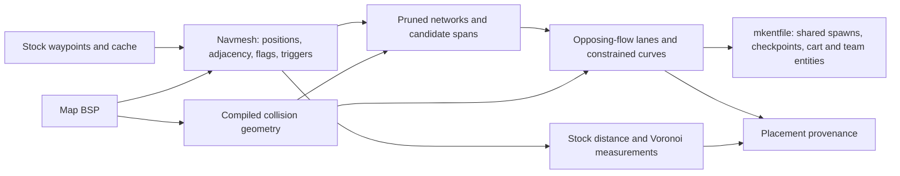

# Cart paths: data, placement, and the recovered implementation

`tools/navmesh.py` owns map navigation and objective placement. `tools/mkentfile.py`
loads that data, calls `place_carts`, and writes the current checkpoint-control
entities. Fusion and inspection tools read navigation directly from `navmesh.py`.
There is no alternate spawn-pair, free-cell-axis, or portal-path cart constructor.

## What the words mean

| Term | Representation and meaning |
| --- | --- |
| Stock navigation / navmesh | Xonotic's bot waypoint **metric graph**, not a triangle navmesh parsed from a 3D model. Positions come from `.waypoints.cache`; saved waypoint boxes and flags come from `.waypoints`. |
| Negative space | `negspace.py`'s compiled BSP collision domain, including brushes and patches. It supplies hull clearance, projection and floor relations. It does not choose objective routes. |
| Player edge | An edge in `Navmesh.adj`, weighted by Euclidean endpoint distance, retained for stock navigation distance. The historical parser treats cache links as undirected. |
| Cart edge | An original player edge that also admits cart motion. `cart_adj` keeps the original node IDs; `cart_nodes` supplies the projected cart-centre coordinates. Jump/teleport/ladder transitions stay in the player graph. |
| Network | A cart-connected component after short terminal branches are pruned. Forks and longer termini survive. |
| Candidate span | A pair of separated termini on a network. Shortest-path routing realizes the pair as a sequence of original waypoint IDs. |
| Cart path / lane | One selected, oriented span, followed by a constrained terrain-following curve. Multiple lanes can use one network. |
| Checkpoint | A scoring position inserted by arclength along the realized curve. Shape vertices do not all score. The origin does not score; the last checkpoint is not a delivery win. |
| Sampling | Historically deterministic farthest-first endpoint selection and greedy span selection. The recovered implementation does **not** randomly sample a pre-existing catalogue of every possible simple path. |

The model/viewer tooling in the history concerns BSP/source geometry and fused-map
joins (`mapsrc.py`, `placement.py`, `joinview.py`, `joinshot.py`, `fusegraph.py`). It is
related to the same maps, but it was not a separate triangle-navmesh cartpath importer.

## The historical review

These identifiers record provenance, not runtime repository selectors or pins.

| Date / historical change | Implemented approach |
| --- | --- |
| August 28, `9d50b5f` through `3c0f28f` | Spawn-derived and fixed-size objective paths. This predates the requested network algorithm. |
| August 29, `206947f` | Parse stock waypoint caches, choose geodesically separated origins with k-center, and connect them using Dijkstra paths. |
| August 29, `5407a63`, `60efe93` | Terrain-following and bending-energy smoothing; adaptive emitted vertices and collision checks. |
| August 29, `6abe228` | Classify generated, flagged, trigger-crossing and geometrically unsuitable links; constrain paths to the bot activation corridor. |
| August 29, `37de01a` | The recovered core: prune short network dangles; generate endpoint combinations; route and repair overlapping spans; choose opposing nearby flow directions. |
| August 30, `b7f6759` | Allocate lanes across multiple cart-connected regions of fused player graphs. |
| August 31, `6c02801` | Extract the navigation/free-volume curve module. Despite the commit title, it includes substantial navigation work. |
| September 4 snapshot, `15bb3c6` | Remove dangle pruning, put Voronoi partition spans ahead of the older solver, prefer short endpoint pairings, reverse the signed-flow objective, require continuous floor contact under a cart-plus-rider hull, and add independent negative-space fallback constructors. |

The September implementation was not wholly unrelated source: much of the August
span solver survived beneath a new early-return path. The consequential changes were:

1. `partition_spans` divided a component into per-cart Voronoi territories and returned
   before the long-span combinatorial search whenever it could.
2. `component_branching` only measured the component; it no longer pruned short dangles.
3. The orientation sort used `(headon, -alignment, -spread)`. Minimizing that tuple
   suppresses opposing flow and prefers positive alignment, reversing the August
   signed-tangent minimization.
4. `CART_RIDER_MAX` plus one-unit floor support replaced the earlier body-clearance
   and nearby-ground criterion. That classified ordinary corridors out of the cart
   graph and made the other constructors the effective algorithm.
5. `realize_cart_tracks` could replace navigation paths with spawn-to-spawn segments,
   free-cell axes or portal paths, so the reported stock network no longer explained
   the shipped lane geometry.
6. The old module's `0x004` / `0x008` jump/teleport constants were wrong too. The saved
   flags are defined in `qcsrc/server/bot/api.qh`: jump bit 14, teleport bit 21, custom
   jump-pad bit 13 and ladder bit 15. The restoration uses those values and checks
   trigger intersections through the interior of a segment.

The starting working tree also contained checkpoint-control changes. Those game
rules, team declarations and checkpoint serialization were retained.

## Current data flow



The public construction calls are:

```python
navigation = navmesh.Navmesh.load(bsp, mapname, archive, data=bsp_bytes)
tracks, paths, measurements = navmesh.place_carts(
    navigation, negative_space, cart_count, push_radius, minimum_length, origin_separation,
)
```

`navigation.nodes`, `.adj`, `.flags` and `.triggerboxes` retain the parsed map data.
Classification adds `.cart_nodes`, `.cart_adj` and `.cart_incompatible`; the last maps
an unordered edge to its exclusion reason. `paths` are waypoint-ID lists; `tracks` are
cart-centre polylines. The emitter passes the same navigation object to spawn-access
measurement rather than making another graph tuple or reconstructing navigation.

`place_carts` performs these operations:

1. Project cart-centre placements into free volume and settle them toward the floor.
   Classify original links by stock transition semantics, trigger crossing, cart-body
   sweep, and nearby walkable ground. Geometry relations cover entire segments.
2. Prune terminal chains shorter than two push radii only when attached to a fork;
   retain cycles and long termini. Sort viable components by their two-sweep geodesic
   extent and allocate requested lanes across them. This keeps the August multi-region
   intent without its geometric region labels or minimum-component-size thresholds.
3. On each host network, choose up to `max(3, 2 * lanes)` farthest-first endpoints,
   enumerate their finite pair distances, and try long-span greedy pairings and the
   historical alternate/crossed pairings. Sequential shortest paths penalize shared
   nodes. The overlap repair reroutes the worst pair or changes its termini. The
   historical 0.3 shared-node fraction is a target, not a promise on every topology.
4. Minimize proximity-weighted signed tangent alignment within two push radii,
   breaking ties toward walking-distance separation of origins. Up to 12 lanes use
   the August exhaustive direction search. Larger populations use deterministic
   coordinate descent on the **same signed objective**, with the search method
   recorded. This avoids applying an exponential search to 256 lanes.
5. Resample each span at 64 units while retaining original turns; reduce squared
   second-difference energy with fixed endpoints and projected terrain-following
   iterates. Accept a curve update only when its entire cart sweep and ground relation
   remain valid and its energy decreases. Separate overlapping origins by advancing
   along the selected curve, retaining at least the minimum lane length.
6. Record the complete network, excluded links, candidate endpoints/counts, selected
   waypoint paths, fitted cart coordinates, direction search and unresolved lane count.
   Stock-graph Voronoi cells are measurements; they do not replace span selection.

The retained geometry interface is `negspace.py`; the newer multi-term C curve
optimizer is no longer on the cartpath call chain. The restored curve objective is
the older squared second-difference energy. Full Cartesian clearance is still required
for the cart body. Ground may be up to 96 units beneath its base; the implementation
computes support intervals instead of the old four/five floor probes. A rider stands
on the cart, so ground contact of the entire combined cart-and-rider bounding box is
not a condition for a lane to exist. Rider overhead clearance is measured separately.

The operator's additional allowance is one or two player-collider widths of activation
radius when needed. The stock-map sweep did not require that widening. The emitter now
writes `radius` and `height` explicitly from the placement configuration, so using a
wider activation area cannot silently disagree with the game's cart dimensions.

An absent navigation cache or a geometric shortage produces an explicit unresolved
lane count and diagnostic output; the emitter continues with the represented lanes
and team entities. No unrelated constructor fabricates a replacement path. Geometric
classification and optimizer acceptance select realizable motion; they do not disable
fleet services, change node capabilities or stop running workloads.

## Callers and output

- `mkentfile.emit`: entry point for the curriculum, training-map staging, map generation
  and fusion. Its positional CLI remains `bsp out.ent teams carts archive checkpoints`.
- `curriculum.py`: hashes the entity-tool Python sources and configuration to identify
  generated assets. A newly started curriculum therefore sees the changed program.
- `joracle/training_maps.py`, `mapgen.py`, `mapfuse.py`: invoke the same emitter.
- `placement.py`, `joinview.py`, `fusegraph.py`: import navigation parsing directly from
  `navmesh.py`; fusion's component selection does likewise.
- `sv_payload.qc`: reads the emitted `plc_path` chain, cart radius/height and speed;
  runtime does not synthesize another route. `cl_payload.qc` displays that chain.

Entity coordinates subtract the cart ride offset once; runtime applies the matching
cart offset. `checkpoint_chain` inserts the configured number of arclength checkpoints
without discarding shape vertices. Independent team declarations remain `plc_team`.

Measurement schema **13** adds `cart_path_plan`, explicit activation dimensions and
`cart_motion_supported_mass`. `advanceable_mass` combines nondegenerate cart motion
with stock-graph spawn reachability. `rider_continuity_relation` now explicitly means
cart-supported rider swept clearance. This is static construction evidence, not a
claim that an engine playthrough or learned policy succeeded. Old rider-support and
new clearance counts should not be compared as though they were the same relation.
Misleading unused k-center “optimum” fields were removed.

The September 4 restoration sweep used the shipped `xonotic-20230620-maps.pk3`:
29 playable BSPs with caches, five teams and four lanes each. All 116 requested lanes
were emitted from stock navigation, with zero cart-motion construction residuals and
580 finite team/cart advanceability pairs. `_hudsetup` and `_init/_init` have no cache
and are not playable-level fixtures. See
[`cartpath-restoration.json`](../../measurements/cartpath-restoration.json) for per-map
lengths and measurements. A separate 16-lane `dance` run emitted all lanes; its maximum
shared-node fraction was 1.0, honestly exposing the crowded graph rather than claiming
the 0.3 target was universally achieved.

For `runningmanctf`, the previous constructor admitted four of 1,221 stock links and
shipped four `negative_space_spawn_origin` lanes. Restoration admits 247 links and
ships four navigation-derived lanes, approximately 5,424 / 2,855 / 2,294 / 2,294 units
long. Rider overhead constraints remain visible independently of cart motion.

The suite also runs from a temporary copy on an x86-64 Linux workstation with NumPy
2.3.5, in addition to the arm64 macOS workspace with NumPy 2.5.2. Generated review
assets are staged separately; live game processes and previously staged matches are
not restarted by this source change.

## Exploration targets and engine navigation

Navigation realization schema 3 contains a `targets` table. Each entry has a stable
cell `id`, its representative navigation `node`, and that node's full XYZ `position`.
The table participates in the realization hash. Measurement schema 14 identifies
entity files generated with this contract.

`mkentfile.py` emits a non-solid `plc_nav_target` marker for each entry, carrying the
same `plc_nav_id` and origin. `LiveBelief` uses this registered position for the cell
instrument; later observations do not move its destination. The eight-float response
carries that ID in the existing cell-target identity field. The QC adapter resolves
it through the marker table and rates the nearest stock waypoint in 3-D. Subsequent
goal reports retain the registered ID, so equal XY coordinates on separate floors
cannot satisfy each other's target comparison. Touch additionally requires physical
3-D proximity to the actual goal entity.

Maps without this table retain legacy grid targets, explicitly encoded with negative
cell target IDs. They continue to use XY waypoint selection. Their observations do
not assert the stronger registered-target contract. Navigation without a waypoint
can use the target marker directly; later waypoint availability remains usable.

The map asset owner is `strat/map_assets.py`: source lookup, extraction, generation,
cache identity and the staged entity/measurement pair live there. Curriculum owns the
match process, not another map parser. Execution/learning joins are documented in
[POLICY-EXECUTION-CONTRACT.md](../../design/POLICY-EXECUTION-CONTRACT.md).
